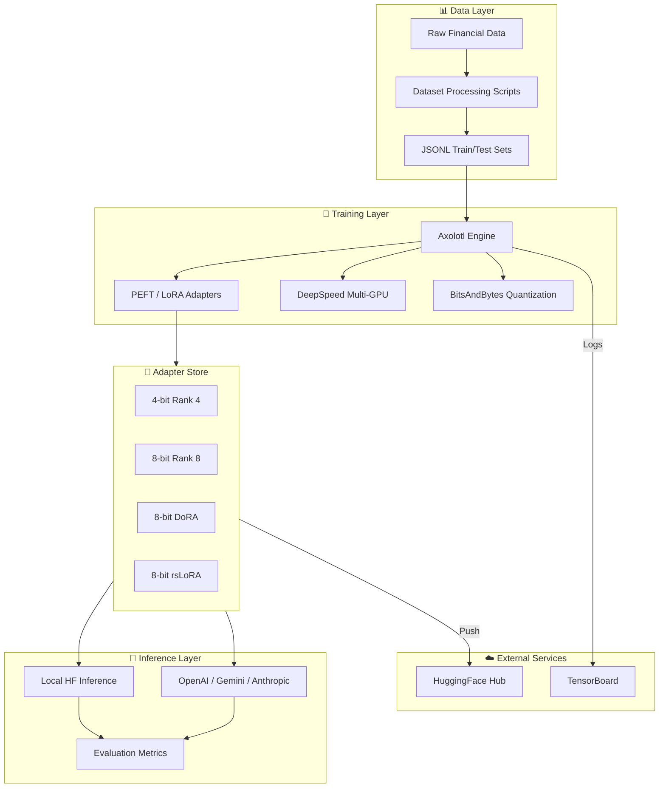
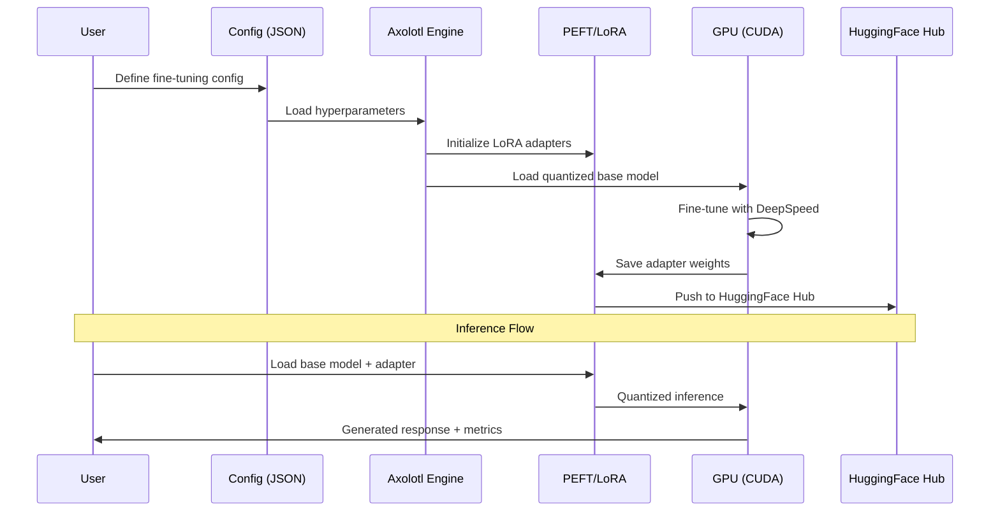
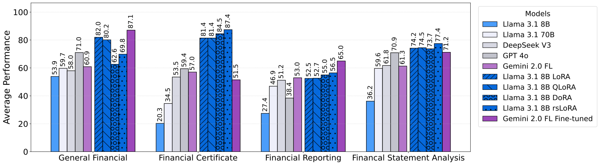

<div align="center">

# 🏦 FinTune

### Parameter-Efficient Fine-Tuning of LLMs for Financial Intelligence

[](https://github.com/nachiket0987)
[](https://linkedin.com/in/nachiket-gadilohar-profile/)
[](LICENSE)
[](https://python.org)
[](https://pytorch.org)
[](https://huggingface.co/wangd12/)
[](https://arxiv.org/abs/2505.19819)

**A production-grade benchmarking framework for parameter-efficient fine-tuning (LoRA/QLoRA/DoRA/rsLoRA) of Large Language Models on 19 financial datasets — from sentiment analysis to XBRL statement analysis and CFA/CPA exam preparation.**

[📊 Datasets](https://huggingface.co/datasets/wangd12/XBRL_analysis) · [🚀 Demo](https://huggingface.co/spaces/ghostof0days/finagents-demo) · [🤖 Models](https://huggingface.co/wangd12/) · [📄 Paper](https://arxiv.org/abs/2505.19819) · [📖 Docs](https://finlora-docs.readthedocs.io/en/latest/)

</div>

---

## 🎯 Executive Overview

**The Problem:** Training financial LLMs from scratch is prohibitively expensive. BloombergGPT required **1 million GPU hours** at an estimated **\$3 million** using 512 A100 GPUs — making financial AI inaccessible to most organizations.

**Our Solution:** FinTune democratizes financial intelligence by leveraging **open-source LLMs** (Llama 3.1) with **LoRA-based fine-tuning**, reducing trainable parameters to as little as **0.01%** of the full model. This enables fine-tuning on **4× A5000 GPUs** at a cost of **less than \$100**.

### 💡 Key Results

| Metric | Value |
|---|---|
| 📈 **Average Accuracy Gain** | **+36%** over base models |
| 💰 **Training Cost** | **<\$100** (vs \$3M for BloombergGPT) |
| 🎓 **CFA Exam Performance** | **>80%** accuracy (vs ~20% base) |
| 🔧 **Trainable Parameters** | **0.01%** of full model |
| 📊 **Datasets Covered** | **19** across 4 financial categories |
| ⚡ **GPU Requirement** | **16-24GB VRAM** (consumer GPUs) |

---

## ✨ Key Features

### 📊 Comprehensive Financial Benchmark Suite
- **19 datasets** across 4 task categories:
  - **General Financial Tasks** (122.9K samples): Sentiment Analysis (FPB, FiQA SA, TFNS, NWGI), Headline Analysis, Named Entity Recognition
  - **Financial Certificate Tasks** (472 samples): CFA Level I/II/III, CPA REG exam preparation
  - **Financial Reporting Tasks** (15.9K samples): XBRL Tagging (FiNER-139, FNXL), XBRL Terminology
  - **Financial Statement Analysis Tasks** (27.9K samples): XBRL Tag/Value Extraction, Formula Construction/Calculation, FinanceBench

### 🔧 Multiple LoRA Methods
```python
# Supported fine-tuning methods
methods = {
    "LoRA":   {"rank": 8, "bits": 8,  "memory": "~20GB"},
    "QLoRA":  {"rank": 4, "bits": 4,  "memory": "~14GB"},
    "DoRA":   {"rank": 8, "bits": 8,  "memory": "~22GB"},
    "rsLoRA": {"rank": 8, "bits": 8,  "memory": "~20GB"},
    "FedLoRA": {"framework": "Flower", "privacy": "federated"},
}
```

### 🤖 Multi-Provider Inference
- **Local**: Hugging Face Transformers + PEFT (GPU/CPU)
- **Cloud APIs**: OpenAI (GPT-4o), Google (Gemini 2.0), Anthropic (Claude), Fireworks AI, Together AI

### 📈 Proven Results
- Fine-tuned Llama 3.1 8B **matches or exceeds GPT-4o** on financial tasks
- **+67.1%** accuracy gain on Financial Certificate tasks
- **+52%** improvement on XBRL Statement Analysis tasks

---

## 🏗️ Architecture



### Data Flow



---

## 🚀 Quick Start

### Prerequisites
- **Python** 3.10+
- **NVIDIA GPU** with CUDA 11.8+ (24GB VRAM for 8-bit, 16GB for 4-bit)
- **Hugging Face** account with access to Llama models

### Installation

```bash
# Clone the repository
git clone https://github.com/nachiket0987/FinTune.git
cd FinTune

# Option 1: Quick setup (recommended)
chmod +x setup.sh
./setup.sh

# Option 2: Conda environment
conda env create -f environment.yml
conda activate fintune
```

### Login to Hugging Face

```bash
huggingface-cli login
# Or set environment variable:
export HF_TOKEN=your_token_here
```

### Fine-Tuning

```bash
# Navigate to the training directory
cd lora

# Fetch DeepSpeed configs for multi-GPU training
axolotl fetch deepspeed_configs

# Run fine-tuning with a predefined config
python finetune.py formula_llama_3_1_8b_8bits_r8
```

### Custom Fine-Tuning Config

Add your configuration to `lora/finetune_configs.json`:

```json
{
  "my_custom_config": {
    "base_model": "meta-llama/Llama-3.1-8B-Instruct",
    "dataset_path": "../data/train/your_dataset_train.jsonl",
    "lora_r": 8,
    "quant_bits": 8,
    "learning_rate": 0.0001,
    "num_epochs": 1,
    "batch_size": 4,
    "gradient_accumulation_steps": 2
  }
}
```

### Inference with LoRA Adapter

```python
from transformers import AutoTokenizer, AutoModelForCausalLM
from peft import PeftModel
import torch

# Load base model
base_model_name = "meta-llama/Llama-3.1-8B-Instruct"
tokenizer = AutoTokenizer.from_pretrained(base_model_name)
base_model = AutoModelForCausalLM.from_pretrained(
    base_model_name,
    torch_dtype=torch.float16,
    device_map="auto"
)

# Apply LoRA adapter
model = PeftModel.from_pretrained(base_model, "./path/to/your/adapter")

# Generate
prompt = "What is the formula for the debt-to-equity ratio?"
inputs = tokenizer(prompt, return_tensors="pt").to(model.device)
outputs = model.generate(**inputs, max_new_tokens=512, temperature=0)
print(tokenizer.decode(outputs[0], skip_special_tokens=True))
```

### Evaluation

```bash
cd test
bash run_all_adapters.sh
```

### Federated Learning

```bash
cd lora/flowertune-llm
pip install -e .
flwr run .
```

---

## 📊 Benchmark Results



FinTune achieves substantial improvements across all financial task categories. Fine-tuned Llama 3.1 8B models show improvements ranging from **+36.4%** to **+67.1%** across different task types.

<details><summary><strong>📋 Full Results Table</strong></summary>

| **Datasets** | **Base Models** | | | | | **Fine-tuned Models** | | | | |
| --- | --- | --- | --- | --- | --- | --- | --- | --- | --- | --- |
| | Llama 3.1 8B Instruct | Llama 3.1 70B Instruct | DeepSeek V3 | GPT-4o | Gemini 2.0 FL | Llama 3.1 8B LoRA | Llama 3.1 8B QLoRA | Llama 3.1 8B DoRA | Llama 3.1 8B rsLoRA | Gemini 2.0 FL |
| **General Financial Tasks** | | | | | | | | | | |
| FPB | 68.73/0.677 | 74.50/0.736 | 78.76/0.764 | 81.13/0.818 | 81.02/0.894 | 85.64/0.922 | 84.16/0.909 | 81.93/0.901 | 82.84/0.853 | **87.62**/0.878 |
| FiQA SA | 46.55/0.557 | 47.27/0.565 | 60.43/0.686 | 72.34/0.773 | 68.09/0.810 | 81.28/**0.884** | 78.30/0.874 | 78.72/0.874 | 73.19/0.806 | **88.09**/0.879 |
| TFNS | 69.97/0.683 | 68.42/0.686 | 84.38/0.846 | 73.32/0.740 | 26.38/0.385 | 88.02/**0.932** | 83.84/0.910 | 59.09/0.702 | 59.51/0.655 | **89.49**/0.896 |
| NWGI | 43.86/0.583 | 50.14/0.596 | 7.44/0.097 | 66.61/0.656 | 48.16/0.614 | 54.16/**0.690** | 49.96/0.645 | 19.57/0.281 | 35.80/0.464 | **62.59**/0.581 |
| NER | 48.89/0.569 | 46.28/0.454 | 40.82/0.360 | 52.11/0.523 | 65.13/0.769 | **98.05**/**0.981** | 96.63/0.966 | 71.59/0.834 | 95.92/0.963 | 97.29/0.973 |
| Headline | 45.34/0.558 | 71.68/0.729 | 76.06/0.779 | 80.53/0.814 | 76.60/0.847 | 84.66/0.852 | 88.03/0.886 | 64.93/0.781 | 71.75/0.828 | **97.32**/**0.973** |
| **Financial Certificate Tasks** | | | | | | | | | | |
| CFA Level 1 | 13.33/0.133 | 42.22/0.418 | 54.44/0.556 | 63.33/0.631 | 55.56/0.556 | 86.67/0.867 | **87.78**/**0.878** | **87.78**/**0.878** | **87.78**/**0.878** | 52.22/0.530 |
| CFA Level 2 | 19.48/0.199 | 29.87/0.303 | 46.75/0.485 | 55.84/0.563 | 56.67/0.567 | 88.31/0.883 | 83.12/0.835 | 90.91/0.909 | **92.21**/**0.922** | 51.11/0.519 |
| CFA Level 3 | 16.67/0.179 | 24.36/0.271 | 47.44/0.496 | 51.28/0.517 | 52.56/0.538 | 70.51/0.705 | 66.67/0.675 | 69.23/0.697 | **79.49**/**0.795** | 51.28/0.557 |
| CPA REG | 31.68/0.317 | 41.58/0.426 | 65.35/0.654 | 67.33/0.667 | 63.37/0.638 | 80.20/0.802 | 88.12/0.885 | **90.10**/**0.901** | **90.10**/**0.901** | 51.28/0.557 |
| **Financial Reporting Tasks** | | | | | | | | | | |
| FiNER | 21.28/0.232 | 61.82/0.606 | 68.92/0.699 | 72.29/0.725 | 63.91/0.638 | 74.10/0.759 | 74.32/0.760 | 70.92/0.732 | 70.72/0.724 | **80.32**/**0.802** |
| FNXL | 3.64/0.045 | 20.14/0.210 | 27.33/0.288 | 42.41/0.398 | 37.75/0.356 | 23.57/0.250 | 23.05/0.253 | 33.50/0.311 | 35.68/0.348 | **47.98**/**0.438** |
| XBRL Term | -/0.574 | -/0.587 | -/0.573 | -/0.584 | -/0.572 | -/0.599 | -/0.606 | -/0.606 | -/0.630 | -/**0.666** |
| **Financial Statement Analysis Tasks** | | | | | | | | | | |
| Tag Extraction | 69.16/0.739 | 69.64/0.782 | 85.03/0.849 | 81.60/0.864 | 80.27/0.811 | **89.13**/0.886 | 86.89/0.872 | 80.44/0.896 | 85.26/0.879 | 85.03/**0.907** |
| Value Extraction | 52.46/0.565 | 88.19/0.904 | 98.01/0.982 | 97.01/0.974 | 98.02/0.980 | 98.49/0.986 | 97.14/0.974 | 98.57/0.988 | 99.13/**0.992** | **99.20**/**0.992** |
| Formula Construction | 12.92/0.201 | 59.28/0.665 | 22.75/0.315 | 79.76/0.820 | 61.90/0.644 | 77.61/0.876 | 89.34/**0.898** | 88.02/0.882 | **89.46**/0.893 | 67.85/0.786 |
| Formula Calculation | 27.27/0.317 | 77.49/0.783 | 85.99/0.868 | 83.59/0.857 | 53.57/0.536 | 98.68/0.990 | 92.81/0.947 | **98.92**/**0.993** | 98.80/0.988 | 54.76/0.548 |
| FinanceBench | -/0.443 | -/0.528 | -/0.573 | -/0.564 | -/0.552 | -/0.511 | -/0.542 | -/0.477 | -/**0.575** | -/0.544 |
| Financial Math | 11.00/0.136 | 10.50/0.134 | 21.50/0.255 | 27.00/0.296 | 19.00/0.204 | 30.00/0.332 | 26.50/0.307 | 28.50/0.317 | 34.50/0.370 | **66.00**/**0.785** |
| **Overall Average** | **37.05** | **52.36** | **57.16** | **63.39** | **58.97** | **74.74** | **74.29** | **69.53** | **73.82** | **71.08** |

</details>

---

## 📁 Project Structure

```
FinTune/
├── data/                         # Dataset processing & data files
│   ├── *.py                      # Processing scripts (sentiment, XBRL, NER, etc.)
│   ├── test/                     # Test datasets (JSONL)
│   └── train/                    # Training datasets (JSONL)
├── docs/                         # Documentation
│   ├── PRD.md                    # Product Requirements Document
│   ├── SRS.md                    # Software Requirements Specification
│   ├── ARCHITECTURE.md           # System Architecture Document
│   ├── UI_UX_DESIGN.md           # UI/UX Specification
│   ├── DEVELOPMENT_PLAN.md       # Development Plan & Roadmap
│   └── source/                   # Sphinx documentation source
├── lora/                         # Fine-tuning implementation
│   ├── finetune.py               # Main fine-tuning script (Axolotl)
│   ├── finetune_configs.json     # Fine-tuning configurations
│   ├── flowertune-llm/           # Federated learning (Flower)
│   └── lora/                     # HuggingFace PEFT-based training
├── lora_adapters/                # Pre-trained LoRA adapter weights
│   ├── 4bits_r4/                 # QLoRA adapters
│   ├── 8bits_r8/                 # Standard LoRA adapters
│   ├── 8bits_r8_dora/            # DoRA adapters
│   └── 8bits_r8_rslora/          # rsLoRA adapters
├── test/                         # Evaluation & inference
│   ├── inference.py              # Multi-provider inference engine
│   ├── test_dataset.py           # Dataset evaluation scripts
│   └── *.sh                      # Evaluation shell scripts
├── .github/CODEOWNERS            # Code ownership
├── environment.yml               # Conda environment
├── requirements.txt              # pip dependencies
├── setup.sh                      # Quick setup script
└── LICENSE                       # MIT License
```

---

## 📚 Engineering Documentation

| Document | Description |
|---|---|
| [📋 PRD](docs/PRD.md) | Product Requirements Document — personas, KPIs, user stories, acceptance criteria |
| [📐 SRS](docs/SRS.md) | Software Requirements Specification — functional requirements, validation rules, security |
| [🏗️ Architecture](docs/ARCHITECTURE.md) | System Architecture — tech stack, diagrams, data flows, deployment |
| [🎨 UI/UX Design](docs/UI_UX_DESIGN.md) | UI/UX Specification — CLI design, TensorBoard layouts, accessibility |
| [📅 Development Plan](docs/DEVELOPMENT_PLAN.md) | Roadmap — Gantt chart, milestones, task dependencies, Definition of Done |

---

## 🔬 LoRA Methods

| Method | Rank | Bits | Key Advantage |
|---|---|---|---|
| **LoRA** | 8 | 8-bit | Standard low-rank adaptation |
| **QLoRA** | 4 | 4-bit | 4-bit NF4 quantization, lowest memory |
| **DoRA** | 8 | 8-bit | Weight-decomposed adaptation |
| **rsLoRA** | 8 | 8-bit | Rank-stabilized scaling |
| **FedLoRA** | configurable | configurable | Federated learning with privacy |

Download pre-trained adapters from the `lora_adapters/` directory or [HuggingFace Hub](https://huggingface.co/wangd12/).

---

## 🤝 Contributing

We welcome contributions! Please feel free to submit issues, feature requests, and pull requests.

1. Fork the repository
2. Create your feature branch (`git checkout -b feature/amazing-feature`)
3. Commit your changes (`git commit -m 'feat: add amazing feature'`)
4. Push to the branch (`git push origin feature/amazing-feature`)
5. Open a Pull Request

---


<div align="center">

### 👨‍💻 Author

**Nachiket Gadilohar**

[](https://github.com/nachiket0987)
[](https://linkedin.com/in/nachiket-gadilohar-profile/)
[](mailto:nachiketlohar0306@gmail.com)

---

⭐ **Star this repo if you find it useful!** ⭐

</div>
