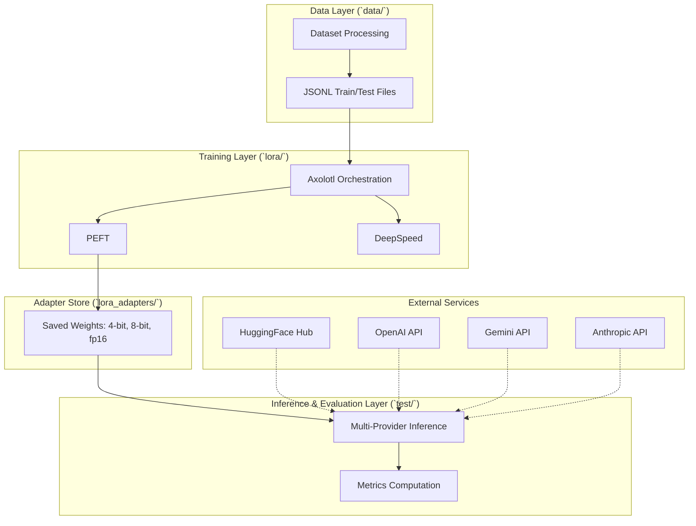
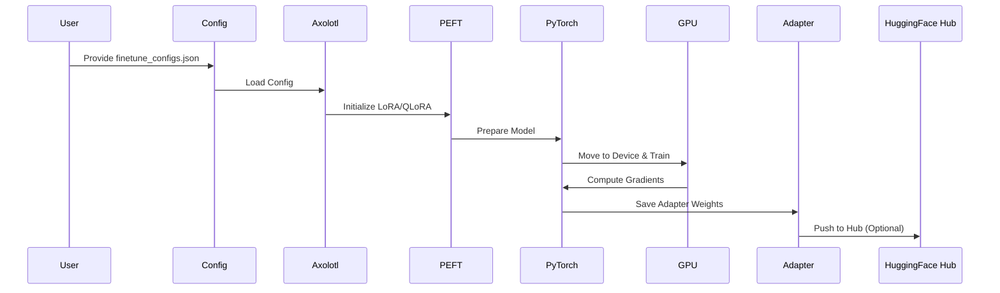
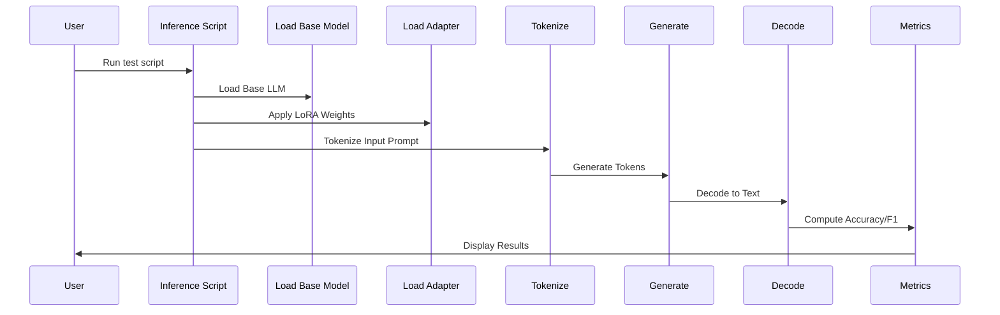

# FinTune System Architecture

## 1. System Overview & Tech Stack

FinTune is a production-grade benchmarking framework for parameter-efficient fine-tuning (LoRA/QLoRA/DoRA/rsLoRA) of Large Language Models on 19 financial datasets.

| Layer | Technology | Version | Purpose |
|---|---|---|---|
| Language | Python | 3.11 | Core runtime |
| ML Framework | PyTorch | 2.4 | Tensor computation & training |
| LLM Library | Transformers | 4.45+ | Model loading & tokenization |
| PEFT | PEFT | 0.13+ | LoRA/QLoRA/DoRA adapter management |
| Training | Axolotl | latest | Fine-tuning orchestration |
| Distributed | DeepSpeed | 0.15+ | Multi-GPU parallelism |
| Quantization | BitsAndBytes | 0.44+ | 4-bit/8-bit quantization |
| Federated | Flower | latest | Federated learning |
| Evaluation | scikit-learn, bert-score | latest | Metrics computation |
| Monitoring | TensorBoard | 2.18 | Training visualization |
| GPU | CUDA | 11.8+ | GPU acceleration |

## 2. System Architecture Diagram

## 3. Package & Component Layout Breakdown

- **`data/`**: Dataset processing scripts and train/test JSONL files. Handles data ingestion, cleaning, and formatting for 19 financial datasets across various tasks.
- **`lora/`**: Fine-tuning code containing Axolotl configurations, PEFT scripts, and Flower federated learning setups.
- **`lora_adapters/`**: Storage for pre-trained LoRA adapter weights (4-bit, 8-bit, fp16) generated during the fine-tuning process.
- **`test/`**: Evaluation and inference scripts supporting multiple providers (HF, OpenAI, Gemini, Anthropic) and computing evaluation metrics.
- **`docs/`**: Documentation including Sphinx-generated docs and specification documents.

## 4. Data Flow Sequence Diagram

### Training Data Flow

### Inference & Evaluation Data Flow

## 5. Database Schema / Data Format Tables

### JSONL Dataset Format
| Field | Type | Description |
|---|---|---|
| `instruction` | String | Task instructions or system prompt |
| `input` | String | The financial text, prompt, or context |
| `output` | String | The expected ground truth response |

### Configuration JSON Schema (`finetune_configs.json`)
| Key | Type | Description |
|---|---|---|
| `base_model` | String | HuggingFace model ID |
| `dataset_path` | String | Path to the JSONL dataset |
| `lora_r` | Integer | Rank of LoRA update matrices |
| `lora_alpha` | Integer | LoRA scaling factor |
| `batch_size` | Integer | Training batch size |
| `learning_rate` | Float | Optimizer learning rate |
| `quantization` | String | "4bit", "8bit", or "fp16" |

## 6. API Specifications

### CLI Arguments

**`finetune.py`**
- `--config`: Path to JSON configuration file (e.g., `finetune_configs.json`)
- `--method`: Fine-tuning method (`lora`, `qlora`, `dora`, `rslora`)
- `--dataset`: Name of the dataset to process

**`inference.py` / `test` Scripts**
- `--model_name_or_path`: Path to base model
- `--peft_model_path`: Path to saved LoRA adapter
- `--provider`: Inference provider (`hf`, `openai`, `gemini`, `anthropic`)
- `--dataset_file`: JSONL file to evaluate

## 7. Security & Encryption Architecture

- **Token Management**: API keys for external services (OpenAI, Gemini, Anthropic, HuggingFace) are managed via environment variables (e.g., `.env` file) and never hardcoded.
- **Model Integrity**: Model weights and adapters are loaded securely using checksums when pulled from the HuggingFace Hub. Local weights are stored in access-controlled directories.

## 8. Deployment Architecture

- **Local GPU Deployment**: Runs on workstations equipped with 16GB-24GB VRAM GPUs (e.g., 4x A5000) using native Python/PyTorch.
- **RunPod / Cloud GPU**: Can be deployed on cloud GPU instances with attached network storage for datasets and adapters.
- **Docker Support (Future)**: Containerized environments for reproducible training and distributed inference.

## 9. Monitoring, Logging & Telemetry

- **TensorBoard Integration**: Loss curves, learning rate scheduling, and validation metrics are logged in real-time.
- **Training Logs**: Axolotl and DeepSpeed output detailed console logs containing epoch progress, memory usage, and throughput (tokens/sec).
- **Evaluation Logs**: Results are saved as JSON/CSV for comparative analysis across datasets.

## 10. Scalability & High-Availability Strategy

- **DeepSpeed Multi-GPU**: Leverages DeepSpeed ZeRO stages to partition optimizer states and gradients across multiple GPUs.
- **Federated Learning**: Uses the Flower framework to distribute training across multiple decentralized nodes, protecting data privacy.
- **Future Enhancements**: Integration of LoRA-MoE (Mixture of Experts) to scale adapter capacity without proportionally increasing inference compute.
