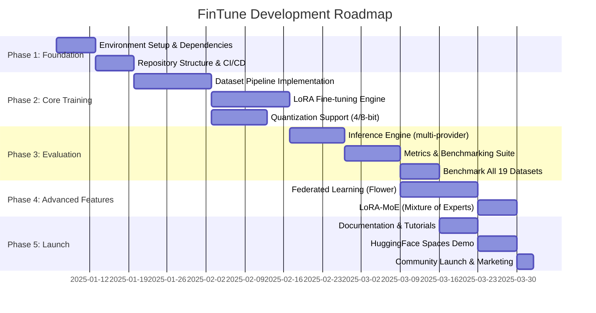

# FinTune Development Plan & Roadmap

## 1. Execution Roadmap Gantt Chart

## 2. 5-Phase Detailed Roadmap

### Phase 1: Foundation (Weeks 1-2)
**Objectives**: Establish the base infrastructure, development environment, and core repository structure.
**Key Deliverables**: Python environment, requirements.txt, CI/CD pipelines, directory structure.
**Tasks**:
- Setup environment (conda, docker) - 3 days
- Resolve dependencies (PyTorch 2.4, Hugging Face, PEFT) - 2 days
- Establish Repo structure (data/, lora/, test/, docs/) - 2 days
- CI/CD Setup (GitHub Actions for linting and tests) - 5 days
- Configure pre-commit hooks - 2 days
**Dependencies**: None.
**Exit Criteria**: Fully working isolated development environment and CI/CD passing on a basic script.

### Phase 2: Core Training (Weeks 3-6)
**Objectives**: Build dataset pipelines and enable single-node LoRA fine-tuning with quantization.
**Key Deliverables**: Dataset processing scripts for JSONL, Axolotl configs, multi-method support (LoRA/QLoRA/DoRA/rsLoRA).
**Tasks**:
- Dataset preprocessing for all 19 datasets - 10 days
- Axolotl integration and configuration templates - 7 days
- Implement BitsAndBytes 4/8-bit quantization support - 5 days
- Implement baseline LoRA methods integration - 6 days
**Dependencies**: Phase 1
**Exit Criteria**: Successful single-task fine-tuning of Llama 3.1 8B on 1 dataset using LoRA without OOM errors.

### Phase 3: Evaluation (Weeks 7-10)
**Objectives**: Establish inference capabilities and benchmark performance across models and datasets.
**Key Deliverables**: Inference scripts, metrics calculation, benchmark logs for 19 datasets.
**Tasks**:
- Multi-provider inference engine (HF, OpenAI, Gemini, Anthropic) - 7 days
- Metrics implementation (accuracy, F1, exact match depending on task) - 5 days
- Automated evaluation pipeline - 5 days
- Run full benchmarks across all 19 datasets with baseline & LoRA - 11 days
**Dependencies**: Phase 2
**Exit Criteria**: Comprehensive benchmark results showing average accuracy improvements across datasets.

### Phase 4: Advanced Features (Weeks 11-13)
**Objectives**: Implement advanced federated fine-tuning and experiment with advanced PEFT techniques.
**Key Deliverables**: Flower integration, Federated LoRA scripts, LoRA-MoE research implementation.
**Tasks**:
- Flower client/server integration for federated learning - 10 days
- Implement Federated LoRA orchestration - 5 days
- Prototype LoRA-MoE - 6 days
**Dependencies**: Phase 3
**Exit Criteria**: Working multi-client federated training loop converging successfully.

### Phase 5: Launch (Weeks 14-16)
**Objectives**: Finalize project for public release and create user-facing assets.
**Key Deliverables**: Sphinx documentation, READMEs, Gradio Demo on HuggingFace Spaces.
**Tasks**:
- Write comprehensive docs and tutorials - 5 days
- Build and deploy Gradio demo app - 5 days
- Finalize README and MIT License - 1 day
- Open source community launch preparation - 3 days
**Dependencies**: Phase 3 (and optionally Phase 4)
**Exit Criteria**: Public GitHub repository with documentation and live demo.

## 3. Priority & Task Dependency Matrix

| Task ID | Task Name | Priority | Depends On | Estimated Days |
|---------|-----------|----------|------------|----------------|
| T1.1 | Environment Setup & Dependencies | P0 | None | 7d |
| T1.2 | Repository Structure & CI/CD | P0 | T1.1 | 7d |
| T2.1 | Dataset Pipeline Implementation | P0 | T1.2 | 14d |
| T2.2 | LoRA Fine-tuning Engine | P0 | T2.1 | 14d |
| T2.3 | Quantization Support (4/8-bit) | P1 | T2.1 | 10d |
| T3.1 | Inference Engine (multi-provider) | P0 | T2.2 | 10d |
| T3.2 | Metrics & Benchmarking Suite | P0 | T3.1 | 10d |
| T3.3 | Benchmark All 19 Datasets | P0 | T3.2, T2.3 | 7d |
| T4.1 | Federated Learning (Flower) | P1 | T3.2 | 14d |
| T4.2 | LoRA-MoE (Mixture of Experts) | P2 | T4.1 | 7d |
| T5.1 | Documentation & Tutorials | P0 | T3.3 | 7d |
| T5.2 | HuggingFace Spaces Demo | P1 | T5.1 | 7d |
| T5.3 | Community Launch & Marketing | P2 | T5.2 | 3d |

## 4. Milestones & Target Deliverables

- **M1: Environment & infra ready** (End of Phase 1)
  - GitHub repo, CI/CD pipelines, base python environment.
- **M2: Single-task fine-tuning working** (End of Phase 2)
  - Full data-to-weights pipeline functioning for Llama 3.1 8B on at least 1 dataset.
- **M3: All 19 datasets benchmarked** (End of Phase 3)
  - Comprehensive results matrix showing >36% average accuracy improvements.
- **M4: Federated learning operational** (End of Phase 4)
  - Flower-based distributed training functional.
- **M5: Public launch with docs & demo** (End of Phase 5)
  - Project officially released with Gradio interface on HuggingFace Spaces.

## 5. MVP Boundary Constraints

**IN (In-Scope for MVP):**
- LoRA / QLoRA / DoRA / rsLoRA methods
- Llama 3.1 8B Instruct as primary testbed model
- All 19 financial datasets (JSONL format)
- CLI-based tool (no web frontend)
- TensorBoard for logging and monitoring

**OUT (Out-of-Scope for MVP):**
- Web UI (beyond basic Gradio demo)
- Real-time API serving endpoints
- Multi-tenant architectures
- Custom model architectures (only using standard HF transformers)

## 6. Definition of Done (DoD) Checklist

- [ ] Code compiles/runs without errors
- [ ] Unit tests pass (>80% coverage)
- [ ] Integration test: full fine-tune + eval pipeline on 1 dataset
- [ ] Documentation updated
- [ ] Code reviewed and merged
- [ ] Performance benchmarks within thresholds
- [ ] No exposed secrets or credentials
- [ ] README updated with usage instructions
