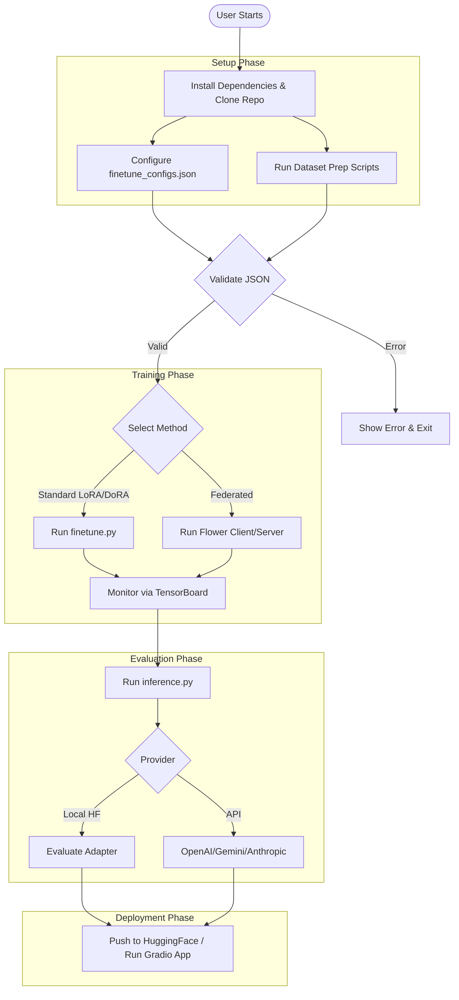

# FinTune UI/UX & CLI Interaction Specification

FinTune is a production-grade benchmarking framework for parameter-efficient fine-tuning (LoRA/QLoRA/DoRA/rsLoRA) of Large Language Models on 19 financial datasets. As a CLI-first research tool, the "UI" consists of the command-line interface, configuration files, terminal outputs, and auxiliary web interfaces like TensorBoard and HuggingFace Spaces Gradio demos.

## 1. Design Philosophy & Theme Tokens

### 1.1 CLI-First Design Philosophy
- **Predictability:** Consistent arguments, flags, and outputs across all scripts.
- **Transparency:** Clear logging of model loading, memory usage, and fine-tuning progress.
- **Modularity:** Separation of configuration (JSON), execution (CLI), and monitoring (TensorBoard).

### 1.2 Theme Tokens (ANSI Colors)
FinTune uses semantic coloring for terminal output to improve readability:
- **Success:** <span style="color:green">Green (`\033[92m`)</span> — Training complete, adapter saved, evaluation passed.
- **Error:** <span style="color:red">Red (`\033[91m`)</span> — OOM errors, missing dependencies, invalid configurations.
- **Warning:** <span style="color:yellow">Yellow (`\033[93m`)</span> — Deprecated flags, non-optimal hardware detected (e.g., missing flash attention).
- **Info/Status:** <span style="color:cyan">Cyan (`\033[96m`)</span> — Loading states, configuration echoes, metrics updates.
- **Typography:** Standard terminal monospace.
- **Spacing:** Consistent 2-space or 4-space indentation for structured output (e.g., config printing).

## 2. User Journey & Navigation Flow Diagram

The following Mermaid diagram maps the end-to-end user journey:



## 3. Screen Layouts & ASCII Wireframe Workspace Diagrams

### 3.1 CLI Help Output Wireframe (`finetune.py`)
```text
$ python lora/finetune.py --help
Usage: finetune.py [OPTIONS]

FinTune: LoRA/QLoRA/DoRA/rsLoRA Fine-tuning Orchestrator

Options:
  --config PATH       Path to JSON config file (default: finetune_configs.json)
  --method TEXT       LoRA variant: [lora, qlora, dora, rslora]
  --dataset TEXT      Dataset name from the 19 supported financial datasets
  --epochs INTEGER    Number of training epochs (default: 3)
  --output_dir PATH   Directory to save adapter weights
  --verbose           Enable debug logging
  --help              Show this message and exit.
```

### 3.2 Training Progress Display Wireframe
```text
[INFO] Loading Llama 3.1 8B Instruct...
[INFO] Applying QLoRA configuration (4-bit)...
[INFO] Memory: 16.2 GB / 24.0 GB VRAM allocated.

Epoch 1/3:  34% |██████████████▍                             | 340/1000 [05:12<10:04, 1.09 it/s]
Loss: 1.2045 | LR: 2e-5 | VRAM: 18.1GB
```

### 3.3 TensorBoard Dashboard Layout
- **Left Sidebar:** Run selectors (filter by LoRA method, dataset, model).
- **Main View (Scalars):** 
  - `train/loss` curve over steps.
  - `eval/loss` curve over epochs.
  - `train/learning_rate` schedule.
- **Main View (System):**
  - GPU Utilization (%).
  - GPU VRAM Usage (MB).

## 4. Component Library & Interaction Specs

### 4.1 Progress Bars (tqdm)
- **Format:** `Epoch {n}/{N}: {percentage}% |{bar}| {n_fmt}/{total_fmt} [{elapsed}<{remaining}, {rate_fmt}]`
- **Dynamic Metrics:** `postfix` dictionary used to append live `Loss`, `LR`, and `VRAM` usage.

### 4.2 Results Table Formatting
Outputs for benchmark evaluations use ASCII tables (via `tabulate` or `Rich`):
```text
+-----------------------+----------+---------+---------+
| Task Category         | Base Acc | LoRA Acc| Improv. |
+-----------------------+----------+---------+---------+
| Sentiment Analysis    | 65.2%    | 89.1%   | +23.9%  |
| XBRL Statement Analys | 54.0%    | 90.5%   | +36.5%  |
+-----------------------+----------+---------+---------+
```

### 4.3 Error Messages
- Prefixed with `[ERROR]` or `[FATAL]`.
- Structure: Context -> Specific Failure -> Suggestion.
- Example: `[ERROR] OOM during forward pass. 24GB VRAM exhausted. Try reducing batch_size or enabling 4-bit QLoRA.`

## 5. Form Layouts & Input Validation Rules

### 5.1 JSON Config Schema Validation (`finetune_configs.json`)
- `base_model`: Must be a valid HF model ID or local path.
- `lora_method`: Enum `["lora", "qlora", "dora", "rslora"]`.
- `lora_r` and `lora_alpha`: Integers > 0.
- `dataset_path`: Must resolve to a valid `.jsonl` file.

### 5.2 Environment Variable Validation
- `HF_TOKEN`: Checked before pushing adapters to Hub or downloading gated models (e.g., Llama 3.1).
- `OPENAI_API_KEY`, `GEMINI_API_KEY`: Checked by `inference.py` when evaluating non-local models.

## 6. Screen States

### 6.1 Loading State
- **Spinner/Log:** `[INFO] Loading deepseek-ai/DeepSeek-V3 in 8-bit mode...`
- **Memory Tracking:** Periodic print of `torch.cuda.memory_allocated()`.

### 6.2 Empty State
- **No dataset found:** `[FATAL] Dataset file 'data/train.jsonl' not found. Please run dataset prep scripts first.`
- **No adapter found:** `[FATAL] Adapter weights missing in 'lora_adapters/'. Did training complete?`

### 6.3 Error State
- **GPU OOM:** Trapped and gracefully exited with memory summary.
- **Invalid Config:** Fails immediately at startup, pointing to the exact JSON line/key.

### 6.4 Success State
- **Completion:** `[SUCCESS] Training finished. Adapter saved to 'lora_adapters/llama3-8b-fin-dora'.`
- Followed by an evaluation summary table.

## 7. Responsive Design (Terminal Width Adaptation)

- **80-column (Standard):** Minimal progress bars, truncated text for long model paths.
- **120-column (Wide):** Full progress bars, extended metric outputs (including gradient norms).
- **CI/CD Mode (No-TTY):** Progress bars are disabled. Emits log lines every N steps instead of using carriage returns.

## 8. Accessibility Standards

- **Color-Blind Safe:** Meaning is never conveyed by color alone. Colors strictly accompany explicit prefixes (`[SUCCESS]`, `[ERROR]`).
- **Screen Reader Compatibility:** Avoids complex ASCII art that disrupts text-to-speech. Uses clean, linear logging.
- **Verbose Mode (`-v`, `--verbose`):** Outputs detailed stack traces and tensor shapes for debugging.
- **Quiet Mode (`-q`, `--quiet`):** Suppresses all output except fatal errors and final JSON results, ideal for automated pipelines.

## 9. HuggingFace Spaces Demo UI (Gradio)

For the public demo, the Gradio interface follows this specification:

- **Header:** Title ("FinTune: Financial LLM Demo") and brief project description.
- **Left Column (Controls):**
  - **Task Selector (Dropdown):** Choose from the 19 financial datasets/tasks.
  - **Base Model (Dropdown):** e.g., Llama 3.1 8B.
  - **Adapter (Dropdown):** Choose LoRA variant (LoRA, QLoRA, DoRA, rsLoRA).
- **Right Column (Interaction):**
  - **Input Text Area:** Pre-filled with an example based on the selected Task.
  - **Run Button:** Primary action button (Primary accent color).
  - **Output Display Area:** Rendered Markdown/Text output from the model.
  - **Metrics Display:** Small cards showing inference time, confidence score (if applicable), and VRAM usage.
